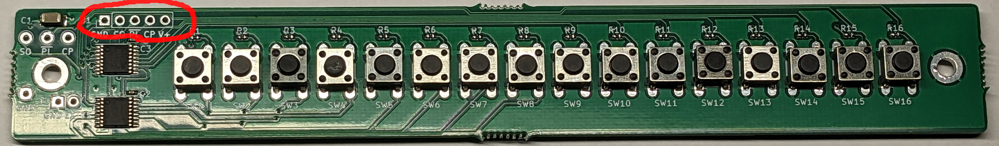

# 16-buttons-san

## PCB with 16 buttons and shift registers

"16-buttons-san" is a handy PCB with 16 buttons, and shift resistors and can also cascade next same PCB.

## Kit contents

- Pre-assembled circuit board
- 1x5 pin socket

## How to assemble

Solder the included 1x05 pin socket into the following place below:

## Sample program

Please refer to the exapmles/Simple
<https://github.com/kinoshita-lab/16-buttons-san/tree/main/software/examples/Simple>
