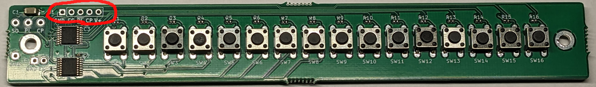

# 16ボタンさん

## シフトレジスタ付きの16個のボタンの基板

16ボタンさんはシフトレジスタで構成された便利な基板です。別の基板にカスケード接続することもできます。

## キットに含まれているもの

- 組みたて済みの基板
- 1x3 ピンソケット

## 組みたてかた

Solder the included 1x05 pin socket into the following place below:

## サンプルプログラム

exapmles/Siple にあるコードを参考にしてください。
<https://github.com/kinoshita-lab/16-buttons-san/tree/main/software/examples/Simple>
